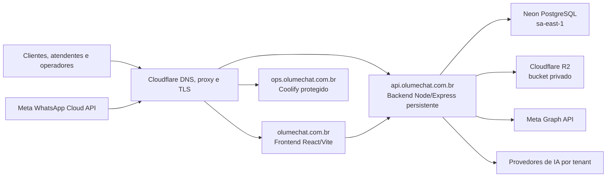

# Plano de deploy — VPS + Coolify + Neon + Cloudflare R2

> **Status:** planejamento aprovado em princípio; infraestrutura ainda não
> provisionada.
>
> **Decisão vigente:** hospedar frontend e backend em uma VPS administrada pelo
> Coolify, mantendo o PostgreSQL no Neon e a mídia no Cloudflare R2.
>
> **Regra de lançamento:** uma única instância do backend até concluir as fases
> de estado distribuído e processamento durável descritas em
> [`ESCALABILIDADE.md`](ESCALABILIDADE.md).

Este documento é o plano oficial para a mudança do desenho
Vercel + Render para VPS + Coolify. Ele foi elaborado a partir:

- do código que existe hoje no repositório;
- das cinco transcrições fornecidas sobre VPS, automação de deploy e system
  design;
- da documentação oficial atual do Coolify, Neon, Cloudflare R2, Cloudflare DNS,
  GitHub e Node.js.

O documento não autoriza executar o deploy automaticamente. Antes de qualquer
compra ou alteração em produção, os itens marcados como **P0** precisam ser
concluídos e testados.

## 1. Decisão executiva

### Arquitetura do primeiro go-live



Na VPS haverá três responsabilidades:

1. Coolify e seu proxy reverso;
2. frontend estático;
3. uma instância persistente do backend.

Neon e R2 continuam fora da VPS. Portanto, trocar ou reconstruir o servidor não
exige restaurar o banco nem copiar a mídia dos clientes.

### Por que frontend e backend serão recursos separados

- o backend precisa manter SSE, `LISTEN/NOTIFY`, webhook e tarefas periódicas;
- o frontend é estático e pode ser cacheado pelo Cloudflare;
- cada recurso pode ser publicado e revertido separadamente;
- o domínio principal continua abrindo a landing page;
- `api.olumechat.com.br` evita passar o SSE por um proxy de plataforma intermediário;
- o desenho já prepara a separação futura de API e workers.

No primeiro momento, não usar Docker Compose para juntar os dois recursos. O
Coolify oferece rolling update para aplicações com health check, mas não para
deploys baseados em Docker Compose. O frontend e o backend devem ser criados como
aplicações separadas no mesmo projeto Coolify.

### O que a VPS não elimina

A VPS reduz a fragmentação entre Render e Vercel, mas não elimina credenciais.
As chaves continuam necessárias porque identificam serviços externos.

- segredos globais são gerados uma vez por ambiente, não a cada deploy;
- credenciais Meta de cada cliente continuam armazenadas cifradas no banco;
- o frontend recebe apenas variáveis públicas `VITE_*`;
- todos os segredos do backend ficam no Coolify e em um gerenciador de senhas;
- nenhuma chave real entra no Git.

## 2. Estado real do projeto

O sistema roda ponta a ponta, porém a configuração de produção atual ainda foi
desenhada para Vercel + Render.

### O que já existe

- CI com testes do servidor e build do frontend;
- `Dockerfile` do backend com usuário não-root e health check;
- `/health/live` e `/health/ready`;
- conexão Neon pooled para a aplicação;
- conexão Neon direta para `LISTEN/NOTIFY`;
- conexão direta de proprietário para migrações;
- driver S3 compatível com R2;
- CORS restrito por `APP_URL` e `CORS_ORIGINS`;
- desligamento por `SIGTERM`/`SIGINT`;
- deduplicação de mensagens da Meta;
- RLS e contexto por tenant;
- locks PostgreSQL em rotinas concorrentes.

### Restrições atuais

- frontend ainda não possui definição de deploy/container para Coolify;
- migrações dependem do `preDeployCommand` do Render;
- o webhook confirma parte do trabalho antes de existir uma fila durável;
- presença, ticket SSE, rate limits e alguns caches ainda vivem na memória;
- o processo da API também executa campanhas, IA e tarefas periódicas;
- readiness não comprova o estado do barramento direto nem do R2;
- CI não testa a imagem Docker nem o isolamento RLS contra um Postgres real;
- não há observabilidade, backup/restauração e staging finalizados;
- o worktree local contém alterações de deploy ainda não publicadas no GitHub.

Essas restrições impedem habilitar duas réplicas do backend agora. Elas não
impedem um go-live controlado com uma instância, desde que os P0 abaixo sejam
resolvidos.

## 3. Decisões antes da compra

### Como cada serviço participa da arquitetura

| Serviço | O que é | Como será usado no Olume Chat | Onde ficam os dados ou processos |
|---|---|---|---|
| Registro.br | registrador de domínios `.br` | registrar e manter `olumechat.com.br` em nome da empresa ou dos responsáveis legais | guarda a titularidade do domínio, não hospeda a aplicação |
| Cloudflare DNS e proxy | DNS autoritativo, proxy reverso, CDN, TLS e proteção de borda | apontar o domínio para a VPS, ocultar o IP de origem quando possível, entregar os arquivos estáticos em cache e proteger os hosts públicos | tráfego passa pela borda Cloudflare; a aplicação continua na VPS |
| Cloudflare Access | controle de acesso Zero Trust | exigir autenticação para `ops` e ambientes de staging | políticas e identidade de acesso ficam na Cloudflare |
| Hostinger VPS | servidor Linux virtual com CPU, RAM, disco e IP próprios | executar Docker, Coolify, proxy, frontend e uma instância persistente do backend | código em execução, logs locais e configuração do Coolify ficam na VPS |
| Coolify | PaaS open source instalado na VPS | conectar o GitHub, publicar containers, guardar variáveis, configurar domínios/TLS, executar health checks, mostrar logs e facilitar rollback | roda na VPS e administra os containers; não substitui banco, bucket, CI ou backup |
| GitHub Actions e GHCR | repositório, CI/CD e registro de imagens Docker | controlar versões, testar, construir imagens imutáveis do frontend/backend, publicar no GHCR e só então liberar o Coolify | código-fonte, histórico, workflows, imagens e artefatos temporários |
| Neon | PostgreSQL gerenciado | armazenar tenants, usuários, clientes, conversas, filas, configurações e auditoria; oferecer conexões pooled, direct e de migração | dados transacionais ficam fora da VPS, na região `sa-east-1` |
| Cloudflare R2 | armazenamento de objetos compatível com S3 | guardar mídias e anexos em buckets privados, acessados por URLs assinadas; receber também backups operacionais separados quando aplicável | arquivos ficam fora da VPS |
| Meta WhatsApp Cloud API | canal oficial de envio e recebimento do WhatsApp | entregar webhooks ao backend e enviar mensagens pelos números de cada empresa | contas, WABAs, números e templates pertencem à configuração Meta de cada cliente |
| Provedores de IA | APIs de modelos configuradas por tenant | executar os recursos de IA contratados por cada empresa, com chave e limite próprios | prompts e respostas trafegam pelo provedor escolhido conforme a função usada |
| Monitoramento externo | verificação independente de disponibilidade e alertas | testar landing page, API e readiness de fora da VPS e avisar em caso de queda | deve estar fora da VPS para continuar alertando se o servidor inteiro parar |

#### Limites de responsabilidade

- a VPS hospeda a aplicação, mas não é o banco nem o arquivo permanente de
  mídias;
- o Coolify facilita a operação, mas não corrige sozinho problemas de código,
  não cria alta disponibilidade e não substitui CI ou recuperação de desastre;
- Cloudflare protege e acelera a borda, mas não elimina a necessidade de
  firewall, atualização e controle de acesso na origem;
- Neon e R2 reduzem o impacto da perda da VPS, mas cada um precisa de política
  própria de retenção, restauração e controle de custo;
- Meta e IA são custos de uso do produto e devem ser medidos por tenant para
  faturamento e margem.

### Domínio

O domínio candidato exibido e disponível em 29/07/2026 é
`olumechat.com.br`. A disponibilidade só fica garantida depois que o pagamento
e o registro forem concluídos.

Plano de nomes:

| Host | Uso | Exposição |
|---|---|---|
| `olumechat.com.br` | landing page e aplicação web | público, proxied |
| `www.olumechat.com.br` | redirecionamento para o domínio raiz | público, proxied |
| `api.olumechat.com.br` | API, SSE e webhook Meta | público, proxied |
| `ops.olumechat.com.br` | painel Coolify | restrito por Cloudflare Access/IP |
| `staging.olumechat.com.br` | frontend de homologação | restrito |
| `api-staging.olumechat.com.br` | API de homologação | restrito |

Não criar wildcard `*.olumechat.com.br` no primeiro deploy. Registros explícitos
reduzem exposição acidental.

#### Compra e titularidade do domínio

- registrar diretamente no Registro.br;
- usar CPF/CNPJ dos responsáveis legais ou da empresa, nunca o cadastro pessoal
  de um prestador;
- habilitar 2FA e guardar códigos de recuperação;
- pagar **R$ 40 por 1 ano** ou **R$ 76 por 2 anos**, conforme a cotação
  apresentada em 29/07/2026;
- o checkout da Hostinger informa um domínio grátis, mas esse benefício não
  entra no orçamento oficial até confirmar que aceita `.com.br`, que a
  titularidade ficará correta e que não criará dependência do provedor da VPS;
- registrar domínio e marca são processos diferentes. O domínio disponível não
  comprova disponibilidade jurídica da marca.

### VPS

O endpoint Neon atual está em `sa-east-1`. A primeira escolha deve ser uma VPS
em São Paulo. Se o provedor não tiver região brasileira, medir a latência até o
Neon antes de contratar por longo prazo.

#### Perfil de compra

| Item | Mínimo de laboratório | Recomendado para produção inicial |
|---|---:|---:|
| CPU | 2 vCPU | 4 vCPU; 8 vCPU se o orçamento permitir |
| RAM | 4 GB | 8 GB; 16 GB se builds ocorrerem na mesma VPS |
| Disco | 50 GB SSD | 100–160 GB NVMe |
| Rede | IPv4 público | IPv4 estático, boa rota para `sa-east-1` |
| Sistema | Ubuntu LTS | Ubuntu Server 24.04 LTS, 64 bits |
| Backup | snapshot manual | snapshot automático do provedor |

O Coolify documenta 2 CPU, 2 GB de RAM e 30 GB livres como mínimo próprio, mas
também alerta que builds no mesmo servidor podem esgotar recursos. O mínimo de
laboratório não é o tamanho recomendado para clientes.

#### Planos Hostinger considerados

Cotação capturada em 29/07/2026. Promoções e renovação precisam ser conferidas
novamente no último passo do checkout.

| Plano | Recursos | Equivalente mensal no contrato de 24 meses | Cobrança antecipada | Renovação de outro contrato de 24 meses |
|---|---|---:|---:|---:|
| KVM 2 | 2 vCPU, 8 GB RAM, 100 GB NVMe, 8 TB de tráfego | R$ 42,99/mês | R$ 1.031,76 | R$ 77,99/mês, total de R$ 1.871,76 |
| KVM 4 | 4 vCPU, 16 GB RAM, 200 GB NVMe, 16 TB de tráfego | R$ 59,99/mês | R$ 1.439,76 | R$ 149,99/mês, total de R$ 3.599,76 |

**Atenção:** R$ 42,99 e R$ 59,99 não são mensalidades avulsas. São o total
promocional de 24 meses dividido por 24, cobrado antecipadamente. Se a opção
selecionada for **mensal**, o desconto vale somente para a primeira cobrança:

- KVM 2: primeira cobrança promocional e **R$ 108,99 já no segundo mês**;
- KVM 4: primeira cobrança promocional e **R$ 196,99 já no segundo mês**.

Os valores de R$ 77,99 e R$ 149,99 são referentes à renovação por mais 24
meses, não à continuidade mês a mês.

O KVM 2 é aceitável para homologação e primeiro go-live controlado porque Neon e
R2 ficam fora da VPS. Ele exige uma única instância do backend, monitoramento de
CPU/RAM, builds controlados e upgrade assim que os limites abaixo forem
atingidos. O KVM 4 é a escolha de menor risco para produção se houver orçamento:
por mais R$ 408 no período promocional de 24 meses, ele dobra CPU, RAM, disco e
tráfego.

Não contratar o KVM 2 supondo que ele suporte carga ilimitada. A aplicação ainda
precisa cumprir os P0 e o teste de carga deste documento.

#### Critérios para escolher o provedor

- região São Paulo;
- firewall no painel do provedor;
- snapshot e restauração documentados;
- console web/rescue mesmo se o SSH falhar;
- upgrade vertical sem reinstalação;
- IPv4 estático;
- métricas de CPU, RAM, disco e rede;
- SLA e suporte compatíveis com produção;
- exportação da imagem ou procedimento de migração;
- preço total após o período promocional.

Não escolher o plano apenas por cupom, vídeo patrocinado ou quantidade nominal
de projetos permitidos.

### Coolify

Coolify é um painel de deploy open source que transforma a VPS em uma plataforma
parecida com Render, Railway ou Heroku, mas sob nosso controle. Ele administra
Docker e o proxy reverso; não é um provedor de VPS.

No Olume Chat ele será responsável por:

- autenticar no GitHub e localizar o commit de produção;
- construir ou baixar as imagens reproduzíveis do frontend e backend;
- injetar os segredos do backend sem colocá-los no repositório;
- associar containers aos domínios;
- emitir e renovar certificados TLS na origem;
- executar health checks e impedir tráfego para uma versão incompleta;
- centralizar logs de deploy e aplicação;
- manter a versão anterior disponível para rollback;
- reiniciar containers de acordo com a política definida.

Ele não será responsável por:

- hospedar Neon, R2 ou Meta;
- decidir se uma migration é segura;
- criar fila durável ou estado compartilhado;
- ser a única cópia das configurações e segredos;
- monitorar uma queda total da própria VPS.

Decisão padrão para o início:

- Coolify self-hosted na mesma VPS;
- uma VPS maior, com no mínimo 8 GB de RAM;
- painel em `ops.olumechat.com.br`;
- acesso administrativo protegido;
- builds monitorados para não disputar recursos com o backend.

Alternativa com menor risco operacional: Coolify Cloud administrando uma VPS
remota. Essa alternativa retira o painel e os builds de controle do mesmo ponto
de falha, mas adiciona uma assinatura. A escolha não muda a arquitetura da
aplicação.

O Coolify self-hosted não possui mensalidade de software. O Coolify Cloud parte
de **US$ 5/mês** para conectar até dois servidores, além do custo normal da VPS.
O orçamento base deste plano adota a versão self-hosted.

### Orçamento inicial

Os valores abaixo são uma fotografia de 29/07/2026 e não uma garantia
contratual. O preço promocional é pago antecipadamente; “por mês” é apenas a
divisão do total pelo prazo.

#### KVM 2 conforme os três checkouts apresentados

| Prazo contratado | Cobrança inicial integral da VPS | Domínio separado | Total sem backup diário | Backup diário no período | Total com backup diário | Próxima cobrança anunciada da VPS |
|---|---:|---:|---:|---:|---:|---:|
| 1 mês | R$ 70,99 | R$ 40 por 1 ano | R$ 110,99 | R$ 32,99 | R$ 143,98 | **R$ 108,99 no segundo mês e nos seguintes** |
| 12 meses | R$ 599,88 | R$ 40 por 1 ano | R$ 639,88 | R$ 395,88 | R$ 1.035,76 | R$ 1.067,88 por mais 12 meses |
| 24 meses | R$ 1.031,76 | R$ 76 por 2 anos | **R$ 1.107,76** | R$ 791,76 | **R$ 1.899,52** | R$ 1.871,76 por mais 24 meses |

Assinar KVM 2 mês a mês durante 24 meses custaria R$ 2.577,76 somente de VPS
(R$ 70,99 no primeiro mês + 23 × R$ 108,99). Com o domínio por dois anos,
seriam R$ 2.653,76, contra R$ 1.107,76 no contrato promocional de 24 meses.
Por isso, o plano mensal só deve ser usado para um teste curto, não como modelo
de produção continuada.

Para o KVM 4 mensal, o planejamento registra R$ 196,99 a partir do segundo mês.
O valor promocional exato da primeira cobrança mensal deve ser copiado do
checkout antes da compra; ele não deve ser confundido com os R$ 59,99
equivalentes do contrato de 24 meses.

O preço futuro do add-on de backup não aparece garantido. Se ele permanecesse em
R$ 32,99/mês, uma renovação de 24 meses do KVM 2, domínio e backup custaria
aproximadamente R$ 2.739,52. Sem o add-on, VPS e domínio custariam
aproximadamente R$ 1.947,76.

#### Comparação mensal equivalente em 24 meses

| Cenário | Desembolso do período | Equivalente mensal |
|---|---:|---:|
| KVM 2 promocional + domínio, sem backup diário | R$ 1.107,76 | R$ 46,16 |
| KVM 2 promocional + domínio + backup diário | R$ 1.899,52 | R$ 79,15 |
| KVM 2 na renovação anunciada + domínio | R$ 1.947,76 | R$ 81,16 |
| KVM 2 na renovação + domínio + backup diário, se o add-on não mudar | R$ 2.739,52 | R$ 114,15 |
| KVM 4 promocional + domínio, sem backup diário | R$ 1.515,76 | R$ 63,16 |
| KVM 4 na renovação anunciada + domínio | R$ 3.675,76 | R$ 153,16 |

#### Recomendação de compra

1. registrar `olumechat.com.br` por dois anos diretamente no Registro.br:
   **R$ 76**;
2. concluir os P0 e confirmar um build limpo antes de iniciar a cobrança da VPS;
3. se a prioridade for menor desembolso, contratar KVM 2 por 24 meses:
   **R$ 1.031,76**, sabendo que pode exigir upgrade;
4. se a prioridade for folga operacional, contratar KVM 4 por 24 meses:
   **R$ 1.439,76**;
5. não contratar inicialmente o backup diário de R$ 32,99/mês. O plano já
   inclui backup semanal e banco/mídia estão fora da VPS;
6. usar a economia do add-on para criar backup externo criptografado da
   configuração do Coolify e ensaiar a reconstrução da VPS;
7. reavaliar o backup diário caso o RTO real exija restauração integral da VPS
   em menos de uma semana.

O backup semanal do provedor e o snapshot manual são camadas auxiliares. Eles
não substituem backup do Neon, proteção do R2 nem uma cópia externa das
configurações, e uma restauração do provedor sobrescreve a VPS inteira.

### Custos dos demais serviços

| Serviço | Custo inicial planejado | Como a cobrança cresce |
|---|---:|---|
| Coolify self-hosted | R$ 0 de licença | consome recursos da VPS e exige manutenção própria |
| Cloudflare DNS, proxy, CDN e SSL | R$ 0 no plano Free | migrar de plano apenas quando recursos/SLA pagos forem necessários |
| Cloudflare Access | R$ 0 para a equipe inicial, dentro do limite Free | plano pago se a equipe ultrapassar o limite ou precisar de SLA/logs maiores |
| GitHub Actions + GHCR | R$ 0 enquanto dentro da franquia | conta Free inclui 2.000 minutos/mês em repositório privado; excedente, artifacts e eventual mudança na política do GHCR são variáveis |
| Neon de desenvolvimento | pode permanecer em US$ 0 dentro do Free | limitado por compute, armazenamento, transferência e janela de restore |
| Neon de produção | reservar inicialmente **US$ 20–30/mês** no Launch | US$ 0,106 por CU-h, US$ 0,35 por GB-mês e histórico/transferência conforme uso |
| Cloudflare R2 Standard | US$ 0 dentro da franquia | após 10 GB: US$ 0,015/GB-mês; US$ 4,50 por milhão de operações A e US$ 0,36 por milhão de operações B acima das franquias |
| Meta WhatsApp Cloud API | sem mensalidade fixa de infraestrutura neste orçamento | cobrança por mensagem entregue, país e categoria; mensagens de serviço na janela de 24 h são gratuitas |
| IA | não incluída no custo-base | tokens/modelos variam por provedor e devem ter orçamento por tenant |
| Monitoramento externo | serviço ainda a selecionar | iniciar em plano gratuito ou reservar verba conforme retenção e alertas exigidos |

A reserva de US$ 20–30 para o Neon é uma estimativa operacional, não uma
mensalidade fixa. Antes do go-live, registrar no documento o plano realmente
contratado, limites de autoscaling e alerta de gasto.

#### Custo-base recomendado

Com KVM 2 por 24 meses e domínio separado:

- desembolso fixo inicial: **R$ 1.107,76**;
- equivalente fixo: **R$ 46,16/mês** durante os primeiros 24 meses;
- reserva variável inicial: **US$ 20–30/mês para Neon**;
- R2 pode iniciar em US$ 0 dentro da franquia;
- Meta e IA variam conforme uso e não devem ser escondidas no custo fixo.

Com KVM 4, o desembolso fixo inicial sobe para **R$ 1.515,76**, ou
**R$ 63,16/mês equivalentes** durante o período promocional.

Configurar alertas de orçamento no Neon, Cloudflare, GitHub, Meta e provedores de
IA. O custo deve ser acompanhado por tenant para que o preço cobrado do cliente
cubra consumo e margem.

#### Quem paga cada conta

- a Olume paga domínio, VPS, Coolify/Cloudflare, GitHub, Neon, R2 e
  monitoramento da plataforma;
- cada cliente deve, preferencialmente, manter sua própria forma de pagamento na
  Meta/WABA;
- quando o cliente informa a própria chave de IA, ele paga diretamente o
  provedor;
- quando a Olume fornece uma chave global, o recurso deve ser vendido como
  add-on com franquia, limite e excedente definidos;
- transcrição de áudio precisa de controle separado: o código atual pode usar a
  chave OpenAI global mesmo quando o chat do tenant usa outro provedor;
- nenhuma chamada de Meta ou IA pode ficar sem `tenant_id`, medição e teto de
  consumo.

Antes da abertura comercial, implementar alerta e bloqueio por orçamento. O
maior risco de custo variável não é a VPS: são campanhas da Meta, IA e áudio sem
limite por tenant.

## 4. Ambientes separados

Produção e homologação nunca compartilham banco, bucket, chaves de aplicação ou
prefixos.

| Recurso | Produção | Homologação |
|---|---|---|
| frontend | `olumechat.com.br` | `staging.olumechat.com.br` |
| API | `api.olumechat.com.br` | `api-staging.olumechat.com.br` |
| Neon | branch `production` | branch `staging` |
| R2 | `olume-media-prod` | `olume-media-staging` |
| Meta | app/números reais homologados | número de teste ou ativos controlados |
| segredos | conjunto exclusivo | conjunto exclusivo |

O sistema armazena mensagens, nomes, telefones, CPF/CNPJ e outros dados
pessoais. Não clonar dados reais para staging sem anonimização. A primeira
homologação deve usar dados sintéticos; uma branch derivada de produção só pode
ser usada depois de existir um processo de mascaramento verificado.

## 5. P0 — trabalho obrigatório antes do go-live

### P0.1 — organizar o repositório

- mover as mudanças locais para branch/PR conforme `docs/WORKFLOW.md`;
- revisar e commitar os arquivos de deploy que hoje estão apenas no worktree;
- manter `main` protegida;
- exigir os checks `server-test` e `client-build`;
- bloquear deploy de commit que não existe em `origin/main`;
- remover artefatos de `tmp/` do escopo do deploy.

**Aceite:** o commit escolhido para produção é reproduzível a partir de um clone
limpo.

### P0.2 — atualizar o runtime

O `Dockerfile` e o CI usam Node.js 20. Essa linha entrou em fim de vida em março
de 2026 e não deve ser usada no novo servidor.

- migrar e testar o projeto em Node.js 24 LTS;
- atualizar `Dockerfile`, CI e `engines`;
- executar a suíte completa;
- validar especialmente `argon2`, PDF/XLSX, upload, IA e build do Vite.

**Aceite:** testes, build e container smoke passam em Node.js 24 LTS.

### P0.3 — definir o frontend no Coolify

Criar uma definição reproduzível para o frontend:

- opção preferida: `client/Dockerfile` multi-stage, com build Vite e Nginx;
- alternativa: build pack Static do Coolify com base directory `client`;
- fallback de SPA obrigatório para rotas como `/login`, `/admin` e `/operador`;
- `index.html` sem cache longo;
- assets com hash e cache imutável;
- `VITE_API_URL=https://api.olumechat.com.br/api`.

**Aceite:** abrir diretamente e recarregar todas as rotas principais retorna o
SPA, sem 404.

### P0.4 — criar um caminho seguro de migração

O Coolify não possui o `preDeployCommand` do `render.yaml`. O projeto precisa de
um mecanismo próprio e reproduzível.

Estratégia inicial:

1. adicionar um lock consultivo global ao runner de migrações;
2. fazer o novo container executar `npm run migrar` antes de iniciar o Node;
3. falhar o boot se a migração falhar;
4. somente marcar o container como ready depois do boot completo;
5. manter apenas uma instância do backend;
6. exigir migrações compatíveis com a versão anterior durante rolling update.

Ao chegar a duas ou mais réplicas, substituir o entrypoint por um release job
único, executado antes das instâncias.

**Aceite:** dois deploys concorrentes não executam DDL em paralelo; uma migração
com erro mantém a versão anterior atendendo.

### P0.5 — tornar segredos fail-fast

Hoje alguns módulos podem gerar segredos e gravá-los no `.env` local. Em
container, esse arquivo é descartável.

- exigir `JWT_SECRET`, `OPERADOR_JWT_SECRET`, `IA_CRYPTO_KEY` e
  `STORAGE_SIGNING_SECRET` em produção;
- não gerar nem persistir segredo automaticamente no container;
- validar que `JWT_SECRET` e `OPERADOR_JWT_SECRET` são diferentes;
- testar boot sem cada segredo e exigir falha clara;
- guardar cópia no gerenciador de senhas.

**Aceite:** recriar o container não muda sessões nem torna credenciais cifradas
ilegíveis.

### P0.6 — tornar a entrada da Meta durável

O risco mais importante é responder `200` ao webhook e perder o processamento
num restart.

Antes de receber tráfego real:

- persistir o evento bruto com chave idempotente antes do ACK;
- devolver erro recuperável quando a persistência falhar;
- registrar estado `recebido`, `processando`, `concluído` ou `falhou`;
- criar recuperação para eventos parados;
- preservar deduplicação por identificador da Meta;
- medir atraso e falha de processamento.

A fila durável completa pode entrar na fase seguinte, mas o evento aceito não
pode existir somente na memória.

**Aceite:** matar o processo logo depois do ACK não perde nem duplica a
mensagem.

### P0.7 — corrigir proxy, readiness e shutdown

- validar `trust proxy` para a cadeia Cloudflare → Traefik → Express;
- garantir que rate limit e auditoria recebem o IP correto;
- readiness deve aguardar a inicialização do hub;
- expor no diagnóstico o estado do `LISTEN/NOTIFY`;
- criar smoke real de upload/leitura/exclusão controlada no R2;
- encerrar timers, workers e conexões SSE com prazo máximo no `SIGTERM`;
- não habilitar `DB_SKIP_HEALTHCHECK=1`.

**Aceite:** rolling update não envia tráfego para um container incompleto e o
container antigo encerra sem ficar preso indefinidamente.

### P0.8 — ampliar o CI

Adicionar depois dos checks atuais:

- teste de RLS contra branch Neon de CI/homologação;
- build da imagem do backend;
- build da imagem ou pacote do frontend;
- boot do container e smoke de `/health/live`;
- scan de segredos;
- scan de dependências e imagem;
- validação de migrations numa branch Neon descartável;
- bloqueio de vulnerabilidade crítica ou alta sem exceção documentada.

**Aceite:** Coolify só recebe o gatilho de deploy depois de todos os checks
obrigatórios passarem.

### P0.9 — remover configuração antiga

- substituir domínios e e-mails antigos da marca;
- remover o prefixo legado `app.olume.com.br/` do formulário do operador e
  torná-lo configurável por ambiente, usando `olumechat.com.br` em produção;
- atualizar `.env.example`, README e nomes de serviço;
- homologar `GRAPH_VERSION` usada pelo código antes do go-live;
- remover dependência operacional de `render.yaml` e `client/vercel.json` sem
  apagar o histórico até o novo deploy estar validado.

**Aceite:** convite, login, CORS, e-mail comercial e links públicos apontam
somente para os domínios definitivos.

## 6. Ordem de provisionamento

### Onda 0 — preparar o código

Concluir todos os P0 e publicar um commit candidato. Não comprar um plano anual
de VPS antes de saber que esse commit constrói e sobe em container limpo.

### Onda 1 — contas e propriedade

1. comprar o domínio;
2. adicionar o domínio à conta Cloudflare da empresa;
3. criar uma organização/equipe no GitHub;
4. criar ou confirmar a organização Neon;
5. confirmar R2 na conta Cloudflare;
6. manter a aplicação Meta no Business Portfolio da empresa;
7. adicionar Filippe Faria e Fernandes Brito como administradores com contas
   individuais;
8. habilitar MFA em todas as contas;
9. registrar códigos de recuperação no gerenciador de senhas.

Não usar uma única conta pessoal compartilhada para operar todos os provedores.

### Onda 2 — contratar e endurecer a VPS

1. criar a VPS com Ubuntu 24.04 LTS;
2. adicionar chaves SSH individuais;
3. desabilitar login por senha;
4. manter acesso root apenas por chave, pois o Coolify o utiliza;
5. habilitar atualizações automáticas de segurança;
6. configurar hostname, timezone UTC e sincronização de relógio;
7. criar snapshot inicial;
8. configurar firewall no painel do provedor.

Portas:

| Porta | Regra |
|---:|---|
| 22/TCP | somente IPs administrativos ou IPs necessários ao Coolify |
| 80/TCP | pública para HTTP/validação TLS |
| 443/TCP | pública para HTTPS |
| 8000/6001/6002 | temporárias na instalação; fechar após domínio do Coolify |
| demais | fechadas |

Não confiar apenas no UFW. O Docker cria regras de NAT que podem contornar
regras tradicionais; o firewall do provedor é a primeira barreira.

### Onda 3 — instalar o Coolify

1. usar uma VPS nova;
2. instalar somente pela documentação oficial;
3. criar imediatamente o primeiro administrador;
4. configurar `ops.olumechat.com.br`;
5. fechar as portas temporárias;
6. proteger o painel com Cloudflare Access ou allowlist;
7. ligar notificações de falha de deploy e recurso;
8. configurar backup do diretório/configuração do Coolify;
9. testar restauração do painel antes de cadastrar produção.

Não instalar banco, MinIO, MongoDB ou R2 local na VPS.

### Onda 4 — configurar DNS e TLS

1. apontar os nameservers do domínio para Cloudflare;
2. criar registros A explícitos para os hosts;
3. ativar proxy nos hosts HTTP/HTTPS públicos;
4. usar TLS end-to-end e modo Full (strict);
5. redirecionar `www` para o domínio raiz;
6. manter registros de e-mail e verificação como DNS only quando exigido;
7. validar certificado e renovação no Coolify.

Regras de cache:

- bypass para `/api/*`;
- bypass para `/webhook*`;
- bypass para `/health*`;
- nunca armazenar respostas `text/event-stream`;
- não cachear `index.html` por longo prazo;
- cache longo somente para assets com hash;
- não aplicar desafio interativo ao webhook da Meta.

### Onda 5 — preparar Neon

1. confirmar a branch de produção;
2. escolher plano compatível com produção e retenção necessária;
3. proteger a branch, quando o plano permitir;
4. restringir acesso ao IP estático da VPS, quando o plano permitir;
5. obter as três URLs:
   - `DATABASE_URL`: pooled, hostname com `-pooler`;
   - `DATABASE_URL_DIRECT`: direta, sem `-pooler`;
   - `MIGRATION_DATABASE_URL`: direta com proprietário;
6. criar branch separada de staging;
7. manter dados sintéticos ou anonimizados em staging;
8. configurar retenção/PITR;
9. testar uma restauração em branch antes do go-live.

O código atual usa corretamente pooled para a aplicação e direta para
`LISTEN/NOTIFY`. Não trocar essas URLs entre si.

### Onda 6 — preparar R2

1. criar `olume-media-prod` privado;
2. criar `olume-media-staging` privado;
3. gerar token **Object Read & Write** limitado a cada bucket;
4. copiar Access Key ID e Secret Access Key no momento da criação;
5. guardar credenciais no gerenciador de senhas;
6. configurar endpoint S3 da conta;
7. não usar domínio público para mídia de clientes;
8. testar upload, download, URL assinada e exclusão;
9. documentar retenção e backup contra exclusão acidental.

Não aplicar lifecycle de exclusão a mensagens/mídias sem uma política jurídica
e de produto definida. Lifecycle é adequado para uploads incompletos, arquivos
temporários e dados cuja expiração foi aprovada.

### Onda 7 — criar os recursos Coolify

Projeto `olume-chat`, ambientes `staging` e `production`.

Frontend:

- repositório privado via GitHub App;
- base directory `client`;
- build em Node.js 24;
- domínio `https://olumechat.com.br`;
- `www` redirecionado;
- variáveis `VITE_*` somente no build;
- preview sem segredos de produção.

Backend:

- build pack Dockerfile;
- base directory raiz;
- porta exposta `10000`;
- domínio `https://api.olumechat.com.br`;
- health check `/health/ready`;
- sem port mapping direto no host;
- rolling update habilitado somente após o health check estar estável;
- limites de CPU/RAM definidos;
- uma única instância.

### Onda 8 — conectar CI/CD

Fluxo:

```mermaid
flowchart LR
    PR["Pull request"] --> CI["Testes, RLS, builds e scans"]
    CI --> MERGE["Merge protegido em main"]
    MERGE --> REL["Workflow de release"]
    REL --> IMG["Build das imagens + publicação no GHCR"]
    IMG --> B["Coolify baixa e publica o backend"]
    B --> H["Migração + readiness + smoke"]
    H --> F["Coolify baixa e publica o frontend"]
    F --> E2E["Smoke externo"]
    E2E --> OK["Release registrada"]
```



Regras:

- desabilitar auto deploy direto no push;
- GitHub Actions aciona o webhook/API do Coolify somente após CI verde;
- preferir imagens prontas no GHCR para não executar builds pesados na VPS,
  especialmente no KVM 2;
- etiquetar cada imagem com commit SHA e aplicar política de retenção;
- não usar n8n, cron ou `git pull` na VPS;
- registrar commit SHA em cada release;
- impedir dois deploys de produção concorrentes;
- publicar backend antes do frontend quando houver mudança de contrato;
- manter pelo menos duas imagens anteriores localmente para rollback;
- notificar sucesso somente depois do smoke externo.

### Onda 9 — configurar Meta

Depois que `api.olumechat.com.br` estiver com TLS válido:

| Campo | Valor |
|---|---|
| Callback URL | `https://api.olumechat.com.br/webhook` |
| Verify token | mesmo `WEBHOOK_VERIFY_TOKEN` do backend |
| Campo | `messages` |

Também:

- confirmar App ID e App Secret;
- validar assinatura `X-Hub-Signature-256`;
- homologar a versão da Graph API;
- concluir requisitos de Embedded Signup/Tech Provider;
- manter credenciais WhatsApp por tenant;
- não configurar `WA_TOKEN`, `WA_PHONE_NUMBER_ID` ou
  `WA_BUSINESS_ACCOUNT_ID` globais em produção;
- testar com um número controlado antes de cadastrar cliente.

## 7. Inventário de variáveis

### Backend — obrigatórias e operacionais em produção

| Variável | Origem | Regra |
|---|---|---|
| `NODE_ENV` | configuração | `production` |
| `PORT` | configuração | `10000` |
| `APP_URL` | domínio | `https://olumechat.com.br`, sem barra final |
| `CORS_ORIGINS` | domínio | opcional; vazio se `www` redirecionar; sem `*` |
| `DATABASE_URL` | Neon | pooled |
| `DATABASE_URL_DIRECT` | Neon | direta para LISTEN/NOTIFY |
| `MIGRATION_DATABASE_URL` | Neon | direta do proprietário |
| `DB_POOL_MAX` | capacidade | opcional; começar em `10` e medir |
| `META_APP_ID` | Meta | global da plataforma |
| `META_APP_SECRET` | Meta | segredo global |
| `GRAPH_VERSION` | Meta | versão homologada |
| `WEBHOOK_VERIFY_TOKEN` | gerado | aleatório, estável |
| `JWT_SECRET` | gerado | aleatório, estável |
| `OPERADOR_JWT_SECRET` | gerado | diferente do anterior |
| `IA_CRYPTO_KEY` | gerado | estável; cifra credenciais |
| `STORAGE_DRIVER` | configuração | `s3` |
| `STORAGE_BUCKET` | R2 | bucket do ambiente |
| `STORAGE_REGION` | R2 | `auto` |
| `STORAGE_ENDPOINT` | R2 | endpoint S3 da conta |
| `AWS_ACCESS_KEY_ID` | R2 | token limitado ao bucket |
| `AWS_SECRET_ACCESS_KEY` | R2 | token limitado ao bucket |
| `STORAGE_SIGNING_SECRET` | gerado | aleatório, estável |

Todos são runtime-only no Coolify, exceto quando o build realmente precisar.
Ativar o modo de segredo bloqueado para valores sensíveis.

### Frontend — públicas

| Variável | Valor |
|---|---|
| `VITE_API_URL` | `https://api.olumechat.com.br/api` |
| `VITE_COMERCIAL_EMAIL` | e-mail comercial definitivo |

Qualquer `VITE_*` entra no JavaScript do navegador e nunca pode conter segredo.

### Gerar segredos

Executar localmente e guardar no gerenciador de senhas:

```bash
node -e "console.log(require('crypto').randomBytes(16).toString('hex'))"
node -e "console.log(require('crypto').randomBytes(48).toString('hex'))"
node -e "console.log(require('crypto').randomBytes(48).toString('hex'))"
node -e "console.log(require('crypto').randomBytes(32).toString('hex'))"
node -e "console.log(require('crypto').randomBytes(32).toString('hex'))"
```

Registrar qual saída pertence a:

1. `WEBHOOK_VERIFY_TOKEN`;
2. `JWT_SECRET`;
3. `OPERADOR_JWT_SECRET`;
4. `IA_CRYPTO_KEY`;
5. `STORAGE_SIGNING_SECRET`.

Esses valores não são regenerados em cada deploy.

## 8. Segurança operacional

- MFA em Cloudflare, Neon, GitHub, Meta, provedor VPS e Coolify;
- contas individuais, sem senha compartilhada;
- SSH somente por chave;
- root sem senha e restrito;
- painel Coolify fora do acesso público comum;
- firewall do provedor como regra principal;
- segredos bloqueados no Coolify e duplicados no cofre;
- produção e staging com credenciais diferentes;
- owner URL do Neon tratada como segredo de maior privilégio;
- logs sem token, corpo de mensagem, URL assinada ou segredo;
- rotação documentada para tokens que aceitam rotação;
- `IA_CRYPTO_KEY` e `STORAGE_SIGNING_SECRET` não podem ser trocados sem plano de
  migração/compatibilidade;
- atualizações do Coolify precedidas por backup;
- dependências e imagem verificadas em toda release.

## 9. Observabilidade desde o primeiro cliente

Monitor externo, fora da VPS:

- `https://olumechat.com.br`;
- `https://api.olumechat.com.br/health/live`;
- `https://api.olumechat.com.br/health/ready`.

Alertas mínimos:

- indisponibilidade por dois ciclos;
- container reiniciando;
- CPU sustentada acima de 80%;
- RAM acima de 85%;
- disco acima de 75%;
- p95 e taxa de 5xx degradando;
- falha ou atraso no webhook;
- eventos persistidos sem conclusão;
- reconexões SSE anormais;
- erro de upload/leitura no R2;
- pool Neon próximo do limite;
- falha de migração;
- falha de backup.

Logs:

- JSON estruturado;
- request/correlation ID;
- commit SHA;
- tenant ID quando seguro;
- nenhuma mensagem ou credencial em claro;
- retenção e busca fora do container.

## 10. Backup e recuperação

### Neon

- retenção/PITR compatível com o RPO escolhido;
- snapshot/branch antes de migração de risco;
- restauração sempre em branch nova para validação;
- exercício de restore trimestral;
- backup lógico adicional periódico se o risco exigir independência do provedor.

### R2

- bucket privado;
- inventário periódico de objetos;
- cópia para destino separado contra exclusão acidental, conforme política;
- teste de recuperação de mídia;
- lifecycle somente para dados explicitamente temporários.

### Coolify/VPS

- snapshot do provedor antes de atualização relevante;
- backup de `/data/coolify` e configuração;
- segredos mantidos também fora da VPS;
- documentação para reconstruir a VPS do zero;
- teste de restauração em servidor descartável.

### Metas operacionais iniciais

Metas, não garantias:

| Medida | Alvo inicial |
|---|---|
| RTO da aplicação | até 2 horas para reconstruir em nova VPS |
| RPO do banco | conforme PITR Neon contratado; validar alvo de até 15 min |
| RPO contra exclusão no R2 | conforme frequência da cópia externa |
| teste de restore | trimestral e antes de mudanças críticas |

## 11. Smoke test de go-live

Executar na ordem:

1. CI completo verde;
2. imagem/backend sobe em ambiente limpo;
3. migrações terminam uma única vez;
4. `/health/live` responde `200`;
5. `/health/ready` responde `200` e confirma banco;
6. landing abre no domínio raiz;
7. refresh de rotas SPA não retorna 404;
8. login do operador funciona;
9. criação de tenant gera link no domínio correto;
10. login de administrador e atendente funciona;
11. CORS rejeita origem desconhecida;
12. SSE fica conectado por pelo menos 30 minutos;
13. SSE reconecta após rolling update;
14. webhook Meta verifica;
15. mensagem receptiva aparece uma única vez;
16. restart após ACK não perde evento;
17. resposta chega ao WhatsApp;
18. status enviado/entregue/lido é atualizado;
19. upload e leitura usam R2;
20. operador entra no tenant e deixa auditoria;
21. campanha controlada não duplica destinatário;
22. IA usa somente credencial do tenant;
23. tema e sessão sobrevivem ao reload;
24. monitor externo e alertas disparam em teste;
25. rollback para a versão anterior é executado e documentado.

## 12. Teste de carga e limite de escala

Antes dos primeiros clientes, executar em staging:

- 20 tenants sintéticos;
- 100–200 conexões SSE;
- rajadas de 10 webhooks por segundo;
- uploads e extrações em paralelo;
- campanha controlada;
- chamadas de IA;
- restart durante processamento;
- validação de isolamento entre tenants.

Depois, executar o cenário maior de [`ESCALABILIDADE.md`](ESCALABILIDADE.md).
Dimensionamento definitivo só pode ser feito com CPU, RAM, latência, pool,
backlog e erro medidos.

### Quando aumentar a VPS

- CPU acima de 70% de forma sustentada;
- RAM acima de 75% fora de builds;
- swap frequente;
- p95 degradando com banco saudável;
- build afeta o atendimento;
- extrações/IA bloqueiam o event loop;
- disco cresce por imagens ou logs.

Primeiro fazer upgrade vertical. Adicionar uma segunda API não é permitido
enquanto presença, tickets SSE, rate limits e filas não forem compartilhados.

### Quando entra load balancer

Somente depois de:

1. Redis/Valkey;
2. tickets SSE e presença compartilhados;
3. rate limits compartilhados;
4. webhook/outbox durável;
5. filas e workers;
6. testes com duas instâncias;
7. readiness completo.

O proxy do Coolify já roteia e termina TLS no primeiro servidor, mas isso não é
alta disponibilidade. Um load balancer só remove o ponto único quando há pelo
menos duas instâncias em hosts independentes.

## 13. Rollback

### Código

1. manter a versão anterior no Coolify;
2. impedir novo deploy;
3. reverter primeiro o frontend se a quebra for visual/contratual;
4. reverter o backend para o commit anterior;
5. confirmar `/health/ready`;
6. repetir smoke de login, SSE e webhook;
7. registrar causa e versão.

### Banco

- migrations são expand/contract e compatíveis com a versão anterior;
- coluna/tabela só é removida em release posterior;
- não editar migration já aplicada;
- rollback de código não executa DDL reverso automaticamente;
- corrupção ou exclusão exige restaurar em branch Neon, validar e só então
  promover a recuperação.

### Servidor

Se a VPS for perdida:

1. criar nova VPS;
2. instalar Coolify;
3. restaurar configuração ou recriar recursos;
4. injetar segredos do cofre;
5. apontar para Neon e R2 existentes;
6. publicar as versões conhecidas;
7. trocar DNS;
8. executar smoke.

## 14. Critério go/no-go

Só liberar o primeiro cliente quando:

- [ ] domínio e contas pertencem à empresa;
- [ ] VPS está na região escolhida e endurecida;
- [ ] Node.js 24 LTS está homologado;
- [ ] repositório está limpo e commit de produção está no GitHub;
- [ ] frontend e backend possuem build reproduzível;
- [ ] CI completo bloqueia deploy com falha;
- [ ] staging está separado;
- [ ] Neon pooled/direct/migration estão corretos;
- [ ] branch de produção tem retenção e restore testado;
- [ ] buckets R2 são privados e separados;
- [ ] segredos são estáveis e estão no cofre;
- [ ] webhook persiste antes do ACK;
- [ ] somente uma instância do backend está ativa;
- [ ] health checks, logs e alertas funcionam;
- [ ] Meta webhook e Embedded Signup foram homologados;
- [ ] smoke completo passou;
- [ ] rollback foi ensaiado;
- [ ] responsável e procedimento de incidente estão definidos.

## 15. O que foi aproveitado das transcrições

Adotado:

- SSH por chave;
- segredos fora do Git;
- CI antes da produção;
- versão/commit rastreável;
- health check e rollback;
- métricas de CPU, RAM, disco e rede;
- cache apenas após medição;
- fila durável, DLQ e workers na fase de escala;
- load balancer somente com múltiplas instâncias prontas.

Rejeitado:

- deploy por `git pull`;
- `npm install` na VPS;
- edição manual de `.env`;
- processo Node em terminal ou `screen`;
- webhook exposto por IP e porta;
- n8n/cron como orquestrador de deploy;
- e-mail como prova de saúde;
- banco ou armazenamento de mídia local;
- Kafka, NoSQL e sharding agora;
- cache com TTL arbitrário em fila/presença;
- auto deploy antes dos testes;
- acesso de agente sem aprovação e com privilégio amplo.

## 16. Referências oficiais

- [Hostinger — Servidor VPS e preços](https://www.hostinger.com/br/servidor-vps)
- [Hostinger — Backup e restauração de VPS](https://www.hostinger.com/br/support/1583232-como-fazer-backup-ou-restaurar-um-servidor-vps-hostinger/)
- [Hostinger — Termos de serviço](https://www.hostinger.com/br/legal/termos-de-servico-universal)
- [Registro.br — Regras e custos de domínio](https://registro.br/dominio/regras/)
- [Coolify — Pricing](https://coolify.io/pricing)
- [Coolify — Installation](https://coolify.io/docs/get-started/installation)
- [Coolify — Concepts and responsibilities](https://coolify.io/docs/get-started/concepts)
- [Coolify — Applications](https://coolify.io/docs/applications/)
- [Coolify — Dockerfile build pack](https://coolify.io/docs/applications/build-packs/dockerfile)
- [Coolify — Health checks](https://coolify.io/docs/knowledge-base/health-checks)
- [Coolify — Rolling updates](https://coolify.io/docs/knowledge-base/rolling-updates)
- [Coolify — Environment variables](https://coolify.io/docs/knowledge-base/environment-variables)
- [Coolify — Domains](https://coolify.io/docs/knowledge-base/domains)
- [Coolify — Firewall](https://coolify.io/docs/knowledge-base/server/firewall)
- [Coolify — GitHub Actions](https://coolify.io/docs/applications/ci-cd/github/actions/)
- [Neon — Production checklist](https://neon.com/docs/get-started/production-checklist)
- [Neon — Connection pooling](https://neon.com/docs/connect/connection-pooling)
- [Neon — Backups](https://neon.com/docs/manage/backups)
- [Neon — Production and staging branches](https://neon.com/branching/production-staging-workflows)
- [Neon — Pricing](https://neon.com/pricing)
- [Cloudflare — Plans](https://www.cloudflare.com/plans/)
- [Cloudflare — Zero Trust pricing](https://www.cloudflare.com/plans/zero-trust-services/)
- [Cloudflare DNS — FAQ](https://developers.cloudflare.com/dns/faq/)
- [Cloudflare R2 — S3 API](https://developers.cloudflare.com/r2/get-started/s3/)
- [Cloudflare R2 — API tokens](https://developers.cloudflare.com/r2/api/tokens/)
- [Cloudflare R2 — Pricing](https://developers.cloudflare.com/r2/pricing/)
- [Cloudflare R2 — Lifecycle](https://developers.cloudflare.com/r2/buckets/object-lifecycles/)
- [Cloudflare DNS — Proxy status](https://developers.cloudflare.com/dns/proxy-status/)
- [GitHub — Status checks](https://docs.github.com/en/pull-requests/reference/status-checks)
- [GitHub — Actions billing](https://docs.github.com/en/billing/concepts/product-billing/github-actions)
- [GitHub — Packages and GHCR billing](https://docs.github.com/en/billing/concepts/product-billing/github-packages)
- [Node.js — Release schedule](https://nodejs.org/en/about/previous-releases)
- [Meta — WhatsApp Cloud API](https://developers.facebook.com/docs/whatsapp/cloud-api/)
- [Meta — Embedded Signup](https://developers.facebook.com/docs/whatsapp/embedded-signup/)
- [Meta — WhatsApp Business Platform pricing](https://business.whatsapp.com/products/platform-pricing)
