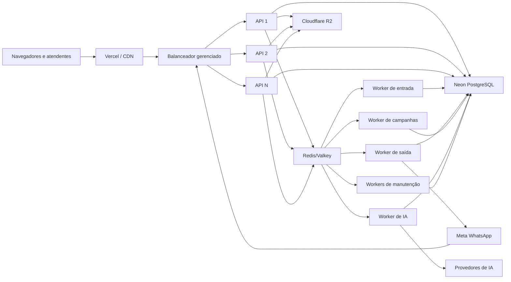

# Escalabilidade e alta disponibilidade

Este documento define como o Falatta deve sair de uma única instância do
backend para uma arquitetura capaz de atender vários clientes simultaneamente,
sem perder mensagens, duplicar campanhas ou distribuir a mesma conversa duas
vezes.

Ele complementa:

- [`DEPLOY.md`](DEPLOY.md), que descreve a primeira publicação;
- [`PORTE.md`](PORTE.md), que registra a migração do sistema legado para SaaS;
- [`SEGURANCA.md`](SEGURANCA.md), cujo contrato continua obrigatório em todos
  os serviços e workers.

## Decisão resumida

Para o primeiro go-live, uma instância persistente do backend é aceitável. Para
usar duas ou mais instâncias, a ordem obrigatória é:

1. adicionar um Redis/Valkey gerenciado;
2. retirar do processo Node todos os estados que precisam ser compartilhados;
3. tornar o webhook durável e mover tarefas demoradas para filas;
4. separar API e workers;
5. somente então habilitar o balanceamento entre múltiplas instâncias da API.

O balanceador de carga é recomendado, mas **não resolve sozinho a
escalabilidade**. Se ele for habilitado antes dessas mudanças, uma requisição
pode cair em uma instância que não conhece o ticket SSE, a presença ou o rate
limit criados por outra.

## O que já está bem encaminhado

O sistema já tem fundações importantes:

- isolamento multi-tenant com `tenant_id` e Row-Level Security;
- Postgres como fonte de verdade;
- deduplicação de mensagens recebidas pelo identificador da Meta;
- blacklist de tokens persistida no banco;
- barramento de tempo real entre instâncias por PostgreSQL `LISTEN/NOTIFY`;
- locks consultivos do PostgreSQL nos workers de fila, bot, campanhas, consumo
  e faturamento;
- reivindicação atômica de itens de campanha;
- rotinas de consumo e faturamento protegidas contra execução simultânea.

Esses mecanismos diminuem o risco da migração, mas não tornam a aplicação
inteiramente stateless.

## Bloqueios atuais para múltiplas instâncias

| Componente | Estado atual | Risco com 2+ instâncias | Destino |
|---|---|---|---|
| `server/realtime/presence.js` | `Map` local | cada instância enxerga uma equipe online diferente | Redis com TTL e heartbeat |
| `server/auth/sseTicket.js` | ticket de uso único em `Map` local | o ticket criado na instância A falha se o stream abrir na B | Redis com consumo atômico |
| limitadores de requisição | memória do processo | o limite é multiplicado pelo número de instâncias | store Redis compartilhado |
| `server/utils/configCache.js` | cache local por tenant | alteração pode demorar a aparecer em outras instâncias | Redis ou invalidação distribuída |
| `server/auth/rbac.js` | cache local de perfil | permissão removida pode continuar válida temporariamente | cache compartilhado e invalidação |
| distribuidor de fila | debounce e ordenação parcialmente locais | decisões concorrentes ou ordem inconsistente | job único por conversa/departamento |
| pós-webhook | `setImmediate` no processo da API | queda após o `200` pode deixar evento sem processamento | outbox + fila durável |
| workers periódicos | iniciados junto da API | API e trabalho pesado competem por CPU e memória | background workers separados |
| health checks | `/health/live` + `/health/ready` com PostgreSQL | readiness ainda não verifica Redis, que ainda não existe | adicionar Redis ao readiness na Fase 1 |

Os locks atuais reduzem duplicidade nos ticks dos workers, mas não substituem
uma fila durável, com retentativa, observabilidade e recuperação de falhas.

## Arquitetura-alvo



### Responsabilidade de cada camada

- **Vercel/CDN:** entrega somente o frontend estático.
- **Balanceador:** distribui HTTP, webhook e novas conexões SSE entre instâncias
  saudáveis da API.
- **API:** autentica, valida, consulta/persiste dados e enfileira trabalho; não
  executa campanhas ou IA no ciclo da requisição.
- **PostgreSQL:** fonte de verdade para tenants, conversas, mensagens,
  faturamento, auditoria e estado final dos jobs.
- **Redis/Valkey:** estado efêmero compartilhado, rate limit, presença, tickets
  SSE, coordenação e filas.
- **Workers:** executam tarefas assíncronas, idempotentes e com retentativa.
- **R2:** armazena mídia; nenhum serviço deve depender do disco local.

## Load balancer

### Recomendação

Usar o balanceador gerenciado do provedor quando a API passar a ter pelo menos
duas instâncias. No Render, o próprio serviço distribui o tráfego entre as
instâncias escaladas; não é necessário manter Nginx, HAProxy ou outro
balanceador próprio nessa fase.

O balanceador traz:

- tolerância à queda de uma instância;
- distribuição de conexões e requisições simultâneas;
- deploys com menor interrupção;
- possibilidade de escala manual e, depois, automática.

Ele não traz:

- sincronização de memória;
- processamento garantido do webhook;
- deduplicação de jobs;
- presença compartilhada;
- proteção contra duas execuções do mesmo efeito externo.

### SSE e afinidade

Uma conexão SSE permanece na instância em que foi aceita enquanto estiver
aberta. Ao reconectar, ela pode cair em qualquer outra instância. Por isso:

- não depender de sessão fixa (*sticky session*);
- guardar o ticket SSE no Redis e consumi-lo de forma atômica;
- guardar presença no Redis com TTL/heartbeat;
- publicar eventos por um barramento compartilhado;
- manter heartbeat do SSE menor que os timeouts da infraestrutura;
- preferir `api.<domínio>` direto para API/SSE, com CORS restrito ao domínio do
  frontend, em vez de depender indefinidamente do proxy da Vercel.

Não depender de afinidade deixa o sistema mais simples de recuperar e permite
substituir instâncias sem derrubar a lógica da sessão.

### Health checks

Criar dois endpoints:

- `/health/live`: confirma apenas que o processo Node está vivo;
- `/health/ready`: confirma que a instância consegue acessar PostgreSQL e
  Redis e concluiu a inicialização.

Somente instâncias `ready` devem receber tráfego. Falha de um provedor externo
como Meta ou IA não deve derrubar o readiness da API, mas deve gerar alerta e
aparecer nas métricas.

## Redis/Valkey: como usar

### Dados adequados

- presença online e heartbeat;
- contagem de abas/conexões por atendente;
- tickets SSE de 30 segundos e uso único;
- rate limits por IP, usuário, tenant e endpoint;
- `lastAssignedAt` e outros dados efêmeros do distribuidor;
- cache de configuração, RBAC, templates e preços;
- filas BullMQ, tentativas, atrasos e jobs agendados;
- sinais de invalidação de cache.

### Dados que continuam no PostgreSQL

- mensagens e conversas;
- vínculo entre cliente, atendente e departamento;
- estado definitivo de campanhas e cobranças;
- permissões e configuração persistente;
- auditoria;
- eventos brutos de webhook e outbox.

Redis nunca deve ser a única cópia de uma mensagem ou de uma decisão
financeira.

### Persistência e política de memória

Filas não podem perder jobs por expulsão de memória. A configuração inicial
recomendada é:

- instância paga com persistência habilitada;
- política `noeviction`;
- TTL obrigatório em todas as chaves de cache, presença, ticket e rate limit;
- alertas de uso de memória e falha de persistência.

Quando o volume justificar, separar:

1. **Redis de filas:** persistente e `noeviction`;
2. **Redis de cache/presença:** política de descarte apropriada, pois suas
   chaves podem ser reconstruídas.

Usar a URL interna autenticada, na mesma região dos serviços, e nunca expor o
Redis diretamente à internet.

## Webhook durável

O webhook é a entrada mais crítica do produto. O fluxo-alvo é:

1. validar a assinatura da Meta;
2. abrir uma transação no PostgreSQL;
3. inserir o evento bruto com chave idempotente;
4. inserir um registro de outbox na mesma transação;
5. confirmar a transação;
6. responder `200`;
7. um relay publica a outbox na fila;
8. o worker processa o evento e grava o resultado;
9. em falha transitória, a fila tenta novamente com backoff;
10. após o limite, o job vai para quarentena e gera alerta.

Se o evento não puder ser persistido, a API deve responder erro para permitir
nova tentativa do remetente. Responder `200` sem ter garantido a posse do
evento cria risco de perda silenciosa.

O padrão outbox evita a janela em que o PostgreSQL confirma o evento, mas a
publicação no Redis falha. Um scanner periódico deve reenfileirar registros de
outbox pendentes e recuperar eventos interrompidos.

Todos os efeitos externos precisam de chave idempotente, principalmente:

- envio de mensagem;
- disparo de template;
- item de campanha;
- cobrança/fatura;
- execução de ferramenta de IA;
- transferência e atribuição de conversa.

## Filas e workers

Usar BullMQ ou outra fila Redis compatível. Separação recomendada:

| Fila/worker | Responsabilidade | Prioridade |
|---|---|---|
| `webhook-inbound` | normalizar evento, persistir mensagem e acionar distribuição | máxima |
| `message-outbound` | enviar texto, mídia e template para a Meta | máxima |
| `conversation-routing` | atribuição por vínculo, departamento e menor carga | alta |
| `ai` | análise, resposta, extração e ferramentas | normal |
| `campaign` | disparos em lote com limites por tenant/canal | normal |
| `maintenance` | consumo, faturamento, limpeza e reconciliação | baixa |

Regras obrigatórias:

- concorrência configurável por worker;
- limites de taxa globais e por tenant;
- retentativa apenas para erros transitórios;
- backoff exponencial com jitter;
- timeout por job;
- idempotência no banco;
- dead-letter/quarentena;
- métricas de tamanho, idade e falhas da fila;
- desligamento gracioso, sem abandonar jobs em processamento.

## Cache

Cache deve reduzir leituras repetitivas, não esconder inconsistências.

| Dado | Estratégia |
|---|---|
| configuração do tenant | cache-aside, chave por tenant, TTL curto e invalidação ao editar |
| perfil/RBAC | TTL curto e invalidação imediata ao alterar papel ou escopo |
| templates e preços | cache-aside e invalidação por versão |
| contadores de dashboard | agregados assíncronos ou TTL curto |
| mensagens/conversa ativa | PostgreSQL + SSE; não usar resposta antiga como verdade |
| presença | Redis com TTL/heartbeat, não cache tradicional |
| cobrança e permissão | sempre confirmar no banco antes de efeito sensível |

Toda chave compartilhada deve incluir `tenant_id`. Exemplos:

```text
falatta:tenant:42:config:v3
falatta:tenant:42:user:817:rbac
falatta:tenant:42:agent:19:presence
falatta:tenant:42:rate:user:817:send
```

Uma mutação administrativa deve persistir primeiro e invalidar depois. Se a
invalidação falhar, o TTL limita a duração da inconsistência.

## PostgreSQL e conexões

- manter `DATABASE_URL` pooled para requisições e workers;
- manter `DATABASE_URL_DIRECT` apenas onde uma sessão é necessária, como
  `LISTEN/NOTIFY`;
- calcular `DB_POOL_MAX × total de processos` antes de aumentar instâncias;
- limitar concorrência dos workers para não esgotar o pool;
- criar índices a partir das consultas reais e de `EXPLAIN ANALYZE`;
- paginar todas as listagens;
- evitar consultas N+1;
- monitorar conexões, latência, locks, tamanho das tabelas e queries lentas;
- não usar scale-to-zero no banco ou na API de produção.

Ter 20 ou 100 empresas não define, sozinho, a capacidade necessária. Os
indicadores que importam são atendentes simultâneos, conexões SSE, mensagens
por segundo, campanhas concorrentes, volume de mídia e uso de IA.

## Observabilidade

Adotar logs JSON com, quando aplicável:

- `request_id`;
- `tenant_id`;
- `user_id` ou `operator_id`;
- `conversation_id`;
- `message_id`;
- `job_id`;
- nome do serviço e versão do deploy;
- duração e resultado;
- código de erro sem segredo ou conteúdo sensível.

Métricas mínimas:

- requisições por segundo, p50/p95/p99 e taxa de erro;
- conexões SSE abertas e reconexões;
- webhook recebido, confirmado, processado e em falha;
- profundidade e idade do job mais antigo por fila;
- tentativas e dead letters;
- tempo até atribuição da conversa;
- conexões e latência do PostgreSQL;
- memória, CPU e event-loop lag;
- latência e erros da Meta, R2 e provedores de IA.

Alertas mínimos:

- webhook persistido sem processamento;
- job antigo ou fila crescendo continuamente;
- erro 5xx acima do limite;
- pool do banco próximo do teto;
- Redis sem memória ou sem persistência;
- nenhuma instância `ready`;
- aumento anormal de reconexões SSE;
- duplicidade detectada em efeito externo.

## Estratégia de implantação

### Fase 0 — primeiro go-live

- manter uma instância do backend;
- impedir scale-to-zero;
- manter `/health/live` e `/health/ready` monitorados;
- configurar backups, alertas e retenção;
- executar smoke test de login, webhook, SSE, envio, mídia e campanha;
- medir a carga real antes de estimar capacidade.

### Fase 1 — estado distribuído

- provisionar Redis/Valkey;
- migrar tickets SSE;
- migrar presença e heartbeat;
- compartilhar rate limits;
- compartilhar/invalidate caches de configuração e RBAC;
- testar duas instâncias simuladas.

**Critério de saída:** ticket criado em A funciona em B, presença é igual nas
duas instâncias e o limite não aumenta ao adicionar servidores.

### Fase 2 — processamento durável

- implementar outbox do webhook;
- adicionar BullMQ;
- mover entrada, saída, distribuição, IA e campanhas para filas;
- adicionar idempotência, retries e quarentena;
- separar API e background workers no `render.yaml`.

**Critério de saída:** reiniciar API ou worker durante o processamento não
perde nem duplica mensagens.

### Fase 3 — alta disponibilidade

- subir a API para no mínimo duas instâncias;
- habilitar o balanceamento gerenciado;
- usar domínio direto para API/SSE;
- configurar CORS restrito;
- testar desligamento forçado de uma instância;
- ajustar pool do banco e concorrência dos workers.

**Critério de saída:** uma instância pode desaparecer sem interromper login,
webhook, SSE reconectado ou processamento das filas.

### Fase 4 — autoscaling

- gerar tráfego sintético e estabelecer a linha de base;
- definir mínimo de duas instâncias da API;
- escalar API por CPU/memória apenas após medir;
- escalar workers principalmente por profundidade e idade de fila;
- revisar limites por tenant e proteção contra cliente ruidoso.

Autoscaling por CPU não enxerga sozinho uma fila parada. Se o provedor não
oferecer escala por métrica de fila, usar alertas e escala programática ou
manter workers dimensionados para o pico previsto.

## Teste de carga antes de vender como alta disponibilidade

Cenário inicial de validação:

- 100 tenants ativos no conjunto de dados;
- 500 atendentes simultâneos com SSE;
- 50 webhooks por segundo em rajada controlada;
- campanhas e IA executando ao mesmo tempo;
- reinício de uma API e de um worker durante o teste.

Metas iniciais, a serem ajustadas com dados reais:

- p95 das APIs comuns abaixo de 500 ms;
- confirmação do webhook abaixo de 250 ms quando o banco está saudável;
- atribuição de conversa abaixo de 2 s;
- nenhuma mensagem perdida;
- nenhum efeito externo duplicado;
- reconexão do SSE sem ação do usuário;
- backlog retornando a zero após a rajada.

O teste deve também validar isolamento: nenhuma resposta, chave Redis, evento
SSE, log ou métrica identificável pode cruzar tenants.

## Variáveis novas previstas

Os nomes finais devem ser confirmados na implementação:

| Variável | Uso |
|---|---|
| `REDIS_URL` | conexão interna autenticada com Redis/Valkey |
| `REDIS_PREFIX` | prefixo do ambiente, por exemplo `falatta:prod` |
| `QUEUE_CONCURRENCY_*` | concorrência de cada worker |
| `QUEUE_ATTEMPTS` | tentativas padrão |
| `QUEUE_JOB_TIMEOUT_MS` | timeout padrão |
| `PRESENCE_TTL_SECONDS` | expiração de presença |
| `SSE_TICKET_TTL_SECONDS` | expiração do ticket de uso único |
| `READINESS_TIMEOUT_MS` | teto dos checks de dependência |

Nunca reutilizar a mesma instância ou o mesmo prefixo Redis entre produção,
homologação e desenvolvimento.

## Ordem segura de investimento

1. durabilidade do webhook;
2. observabilidade e alertas;
3. Redis/Valkey e estado distribuído;
4. filas e workers separados;
5. duas instâncias da API com load balancer;
6. teste de carga e falha;
7. autoscaling;
8. otimizações de cache guiadas por métricas.

Adicionar cache antes de medir pode aumentar a complexidade sem atacar o
gargalo real. Durabilidade, isolamento e idempotência têm prioridade sobre
ganhos marginais de latência.

## Referências técnicas

- [Render — Scaling services](https://render.com/docs/scaling)
- [Render — Multi-service architectures](https://render.com/docs/multi-service-architecture)
- [Render — Key Value](https://render.com/docs/key-value)
- [BullMQ — Idempotent jobs](https://docs.bullmq.io/patterns/idempotent-jobs)
- [Neon — Connection pooling](https://neon.com/docs/connect/connection-pooling)
