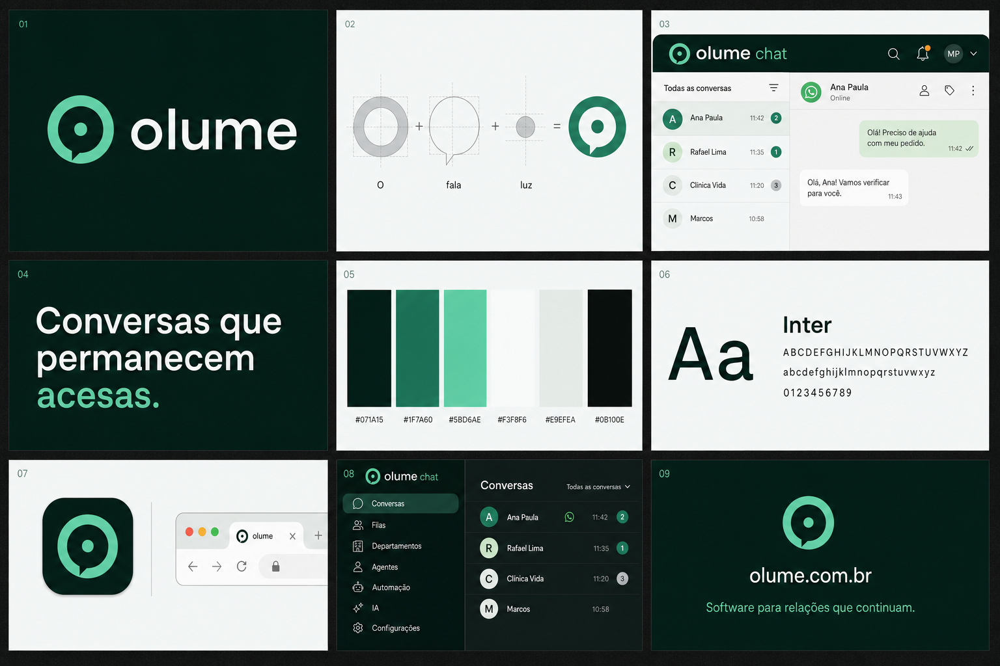

# Olume — direção de marca

## Arquitetura

- **Olume** é a empresa e a marca-mãe.
- **Olume Chat** é o produto de atendimento.
- A assinatura preferencial é `olume chat`, sempre com `chat` visualmente secundário.
- Em textos institucionais, usar: **Olume Chat, um produto Olume.**

## Conceito

**Conversas que permanecem acesas.**

O símbolo combina três elementos em uma única construção geométrica:

1. o `O` de Olume;
2. o contorno de um balão de conversa;
3. um núcleo aceso, que representa presença, contexto e continuidade.

O desenho deve funcionar como ícone do aplicativo, favicon, avatar, assinatura do
produto e marca reduzida na navegação.

## Paleta

| Token | Cor | Uso |
|---|---|---|
| Forest Ink | `#071A15` | marca escura, navegação e fundos institucionais |
| Operational Green | `#1F7A60` | ações principais e estados ativos |
| Signature Mint | `#5BD6AE` | reconhecimento da marca e destaques |
| Soft Fog | `#F3F8F6` | fundo claro do produto |
| Warm Paper | `#E9EFEA` | superfícies secundárias |
| Near Black | `#0B100E` | texto e contraste máximo |

Âmbar pode aparecer apenas como cor funcional de aviso. Não faz parte do núcleo
da identidade.

## Tipografia

- Direção: sans-serif humanista, contemporânea e de alta legibilidade.
- Referência inicial: **Inter** para produto e comunicação.
- O wordmark deve ser minúsculo: `olume`.
- Evitar pesos excessivamente arredondados ou geométricos que infantilizem a marca.

## Regras de aplicação

- Não separar o ponto central do símbolo.
- Não usar gradiente como única forma de reconhecer a marca.
- Não transformar o símbolo em lâmpada, chama ou dois balões sobrepostos.
- Não usar verde de WhatsApp como cor principal.
- Não misturar `Olume`, `Olume Chat` e o nome antigo na mesma superfície.
- Em interfaces compactas, preferir símbolo + `olume chat`.
- Em materiais corporativos, preferir símbolo + `olume`.

## Família futura

- Olume Chat
- Olume Flow
- Olume CRM
- Olume AI

## Referência visual

## Arquivos da marca

### Vetores

- [Símbolo](./assets/olume-mark.svg)
- [Símbolo para fundo escuro](./assets/olume-mark-inverse.svg)
- [Logo Olume](./assets/olume-logo.svg)
- [Logo Olume para fundo escuro](./assets/olume-logo-inverse.svg)
- [Logo Olume Chat](./assets/olume-chat-logo.svg)
- [Logo Olume Chat para fundo escuro](./assets/olume-chat-logo-inverse.svg)
- [Ícone do aplicativo](./assets/olume-app-icon.svg)

### PNG

- [Símbolo](./assets/olume-mark.png)
- [Símbolo para fundo escuro](./assets/olume-mark-inverse.png)
- [Logo Olume](./assets/olume-logo.png)
- [Logo Olume para fundo escuro](./assets/olume-logo-inverse.png)
- [Logo Olume Chat](./assets/olume-chat-logo.png)
- [Logo Olume Chat para fundo escuro](./assets/olume-chat-logo-inverse.png)

Os SVGs são a fonte preferencial para interfaces e materiais gráficos. Os PNGs
servem para integrações que não aceitam vetores. Favicons, ícones PWA e cartão
social são gerados por `generate_assets.py` e publicados pelo frontend.
